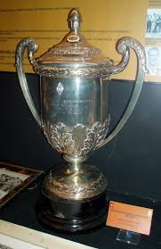

# El club mas grande del mundo
## El Real Madrid Club de Fútbol fue fundado el 6 de marzo de 1902. Desde sus inicios, se destacó en el fútbol español y europeo.
En 1920, recibió el título de "Real" por el rey Alfonso XIII. A lo largo de su historia, ha ganado numerosos títulos, incluyendo más de 30 campeonatos de La Liga y 14 Copas de Europa, convirtiéndose en uno de los clubes más exitosos del mundo. 
Su famoso estadio, el Santiago Bernabéu, es un ícono del deporte. Además, ha tenido grandes jugadores como Alfredo Di Stéfano, Cristiano Ronaldo y muchos más. ¡Es un club con una rica tradición y una apasionada afición!

### En la actualuidad tiene:  

####                  - Trofeo FIFA al mejor club del siglo XX

####                  - 15 Copas de Europa

####                  - 8 Mundiales de club 

####                  - 6 Supercopas de Europa

####                  - 2 Copas de la UEFA

####                  - 36 Ligas

####                  - 20 Copas del rey

####                  - 13 Supercopas de España

####                  - 1 Copa de la liga 

####                  - 2 Pequeñas copas del mundo

####                  - 2 Copas latinas

####                  - 1 Copa Iberoamericana

####                  - 18 Campeonatos Regionales

####                  - 5 Trofeos Mancomunados

[Volver](https://github.com/Marcos-pro17/Real-Madrid.es/blob/main/README.md) 
