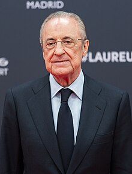
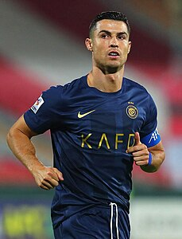

<div align="center">
  
# Real-Madrid.
### "Noventa minuti en el Bernabeu son molti longo"

  
## [Historia del Real Madrid](https://github.com/Marcos-pro17/Real-Madrid.es/blob/main/Historia%20del%20Real%20Madrid.md)

</div> 

### [Equipo actual](https://www.realmadrid.com/es-ES/futbol/primer-equipo-masculino/plantilla) 


```html```
<section id="featured-players">
    <h2>Jugadores Destacados</h2>
    <div class="players-container">
        <div class="player-card">
            
            <h3>Vinícius Jr.</h3>
            <p>Delantero</p>
            <p>Uno de los jugadores más electrizantes del fútbol mundial, conocido por su velocidad y habilidades.</p>
        </div>
        <div class="player-card">
            
            <h3>Jude Bellingham</h3>
            <p>Mediocampista</p>
            <p>El joven mediocampista inglés es una de las promesas del fútbol europeo y pieza clave del equipo.</p>
        </div>
        <div class="player-card">
            
            <h3>Thibaut Courtois</h3>
            <p>Portero</p>
            <p>El guardameta belga ha sido decisivo en los últimos títulos del equipo con sus increíbles paradas.</p>
        </div>
    </div>
</section>

<style>
    #featured-players {
        text-align: center;
        margin: 50px 0;
    }
    .players-container {
        display: flex;
        justify-content: space-around;
        gap: 20px;
    }
    .player-card {
        background-color: #f4f4f4;
        padding: 20px;
        border-radius: 10px;
        width: 30%;
        box-shadow: 0 4px 8px rgba(0, 0, 0, 0.1);
    }
    .player-card img {
        width: 100%;
        border-radius: 10px;
        margin-bottom: 15px;
    }
    .player-card h3 {
        font-size: 22px;
        color: #00529F;
    }
    .player-card p {
        font-size: 16px;
        color: #333;
    }
</style>
```

### [Presidente actual](https://es.wikipedia.org/wiki/Florentino_P%C3%A9rez)

 


### [Mejor jugador del Real Madrid de la história](https://ca.wikipedia.org/wiki/Cristiano_Ronaldo_dos_Santos_Aveiro) 



